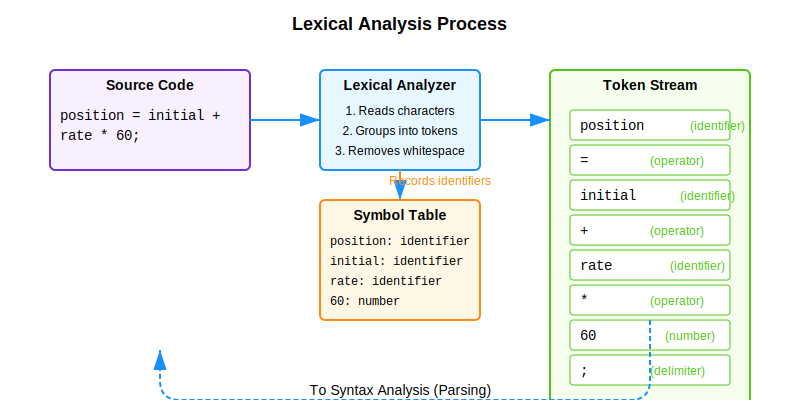
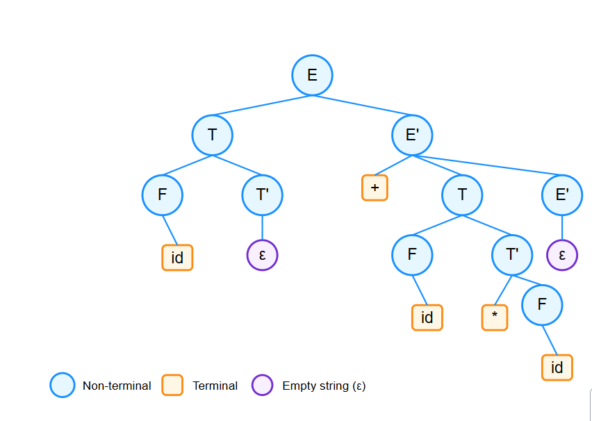
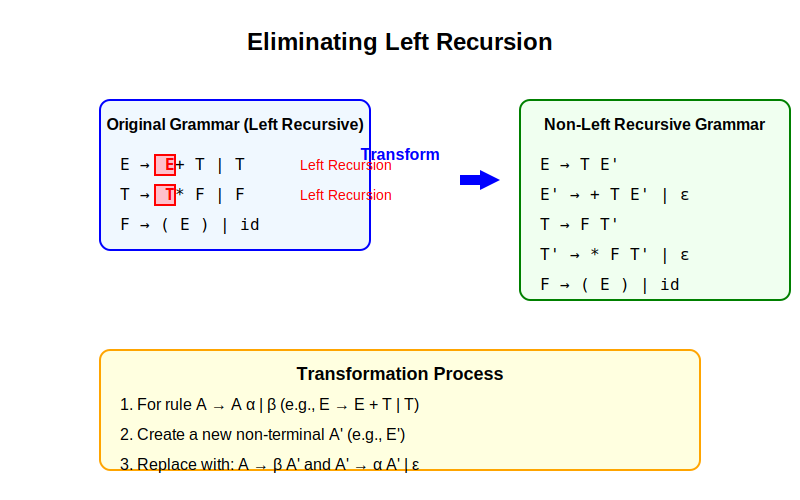

# Detailed Notes on Compiler Design - Unit 1

## Introduction to Compilers

### Compiler Definition
A compiler is a program that translates code written in a high-level programming language (source code) into a lower-level language (target code), typically machine code or assembly language.

### Interpreter vs Compiler

| Compiler | Interpreter |
|----------|-------------|
| Translates entire program at once before execution | Translates and executes code line by line |
| Creates an executable file | No separate executable is created |
| Execution is faster after compilation | Execution is generally slower |
| Error messages shown after entire compilation | Error messages shown immediately for each line |
| Examples: C, C++, Java compilers | Examples: Python, JavaScript interpreters |

### Phases of a Compiler

A compiler typically works in the following phases:

1. **Lexical Analysis**: Breaks source code into tokens
2. **Syntax Analysis**: Organizes tokens into a parse tree
3. **Semantic Analysis**: Checks for semantic errors
4. **Intermediate Code Generation**: Creates intermediate representation
5. **Code Optimization**: Improves intermediate code
6. **Code Generation**: Produces target code

Let's look at each phase in more detail:

#### 1. Lexical Analysis
- The first phase of compilation
- Also called "scanning"
- Converts source code into meaningful tokens
- Removes whitespace, comments
- Identifies identifiers, keywords, numbers, operators, etc.

**Example**: For the statement `position = initial + rate * 60`

Tokens would be:
- `position` (identifier)
- `=` (assignment operator)
- `initial` (identifier)
- `+` (addition operator)
- `rate` (identifier)
- `*` (multiplication operator)
- `60` (numeric constant)

### Role of Lexical Analyzer
- Reads source code as stream of characters
- Groups characters into tokens
- Handles whitespace and comments
- Communicates with symbol table
- Reports lexical errors (invalid characters, etc.)

**Visual Representation of the Lexical Analysis Process:**



### Regular Expressions
Regular expressions are notation for describing patterns of text. They are used to define the patterns of tokens in lexical analysis.

**Basic Regular Expression Operations**:
- Concatenation: ab (a followed by b)
- Alternation: a|b (either a or b)
- Kleene closure: a* (zero or more occurrences of a)
- Positive closure: a+ (one or more occurrences of a)
- Option: a? (zero or one occurrence of a)

**Example**:
- Identifier pattern: letter(letter|digit)*
- Integer pattern: digit+
- Float pattern: digit+.digit+

### Finite Automata
Finite Automata (FA) are abstract machines used to recognize patterns. They are used in implementing lexical analyzers.

Two types:
1. **Deterministic Finite Automata (DFA)**: Each input symbol takes to exactly one state
2. **Non-deterministic Finite Automata (NFA)**: Can have multiple possible transitions for a single input

**Example of DFA for recognizing identifiers and numbers:**


### From Regular Expressions to Finite Automata
Regular expressions can be converted to NFAs using Thompson's Construction, and NFAs can be converted to DFAs using the Subset Construction algorithm.

**Process**:
1. Convert regular expression to NFA
2. Convert NFA to DFA (for efficiency)
3. Minimize DFA (optional, for further efficiency)

### Pass and Phases of Translation

**Pass**: A complete scan of the source program or an intermediate representation.

**Single-pass compiler**: Does all the work in one go through the source code.

**Multi-pass compiler**: Makes multiple passes, with each pass performing specific tasks.

### Bootstrapping
Bootstrapping is the process of using a compiler to compile itself.

**Steps in bootstrapping**:
1. Write compiler for language L in another language (e.g., write a C compiler in Assembly)
2. Use this compiler to compile a compiler for L written in L itself
3. Now you have a compiler for L written in L

### LEX - Lexical Analyzer Generator
Lex (or Flex in newer systems) is a tool that generates lexical analyzers.

**How Lex works**:
1. Developer specifies patterns (regular expressions) for tokens
2. Lex generates C code for a lexical analyzer
3. The generated code can be compiled and used as part of a compiler

**Example Lex specification**:
```
%{
/* C declarations */
%}

%%
/* Rules section */
[0-9]+      { return INTEGER; }
[a-zA-Z]+   { return IDENTIFIER; }
"+"         { return PLUS; }
"-"         { return MINUS; }
%%

/* User subroutines */
```

## Parsing

### Role of Parser
The parser performs syntax analysis. It:
- Takes tokens from lexical analyzer
- Verifies that tokens form a valid sequence according to grammar rules
- Builds a parse tree or syntax tree
- Reports syntax errors

### Context-Free Grammar (CFG)
A context-free grammar consists of:
- A set of terminal symbols (tokens)
- A set of non-terminal symbols (syntactic variables)
- A set of productions (rules)
- A start symbol (a designated non-terminal)

**Example CFG for simple expressions**:
```
E → E + T | T
T → T * F | F
F → ( E ) | id
```
Where E = Expression, T = Term, F = Factor, id = identifier

### Derivations
A derivation is a sequence of production rule applications that shows how a string can be generated from the start symbol.

**Types of Derivations**:
1. **Leftmost derivation**: Always replace the leftmost non-terminal
2. **Rightmost derivation**: Always replace the rightmost non-terminal

**Example**:
Leftmost derivation of "id + id * id" using the above grammar:
```
E ⇒ E + T ⇒ T + T ⇒ F + T ⇒ id + T ⇒ id + T * F ⇒ id + F * F ⇒ id + id * F ⇒ id + id * id
```

### Parse Trees
A parse tree visually represents the derivation of a string.
- Root is the start symbol
- Internal nodes are non-terminals
- Leaf nodes are terminals
- The yield (reading leaves from left to right) gives the original string

**Example Parse Tree for "id + id * id" using the non-left-recursive grammar:**




### Ambiguity
A grammar is ambiguous if there exists a string that can have more than one parse tree (or more than one leftmost or rightmost derivation).

**Example of ambiguous grammar**:
```
E → E + E | E * E | ( E ) | id
```

For the string "id + id * id", we can have two different parse trees:
1. (id + id) * id
2. id + (id * id)

**Visual representation of ambiguous parse trees:**


### Elimination of Left Recursion
Left recursion is a situation where a non-terminal appears as the leftmost symbol in its own definition. This causes problems for top-down parsers.

**Example of left recursion**:
```
A → A α | β
```

**Algorithm to eliminate left recursion**:
```
Replace A → A α | β with:
A → β A'
A' → α A' | ε
```

**Example**:
Original grammar:
```
E → E + T | T
```
After eliminating left recursion:
```
E → T E'
E' → + T E' | ε
```

**Visual representation of left recursion elimination:**



### Left Factoring
Left factoring is a grammar transformation that is useful for creating predictive parsers. It's used when multiple productions for a non-terminal begin with the same symbols.

**Example**:
Original grammar:
```
A → α β | α γ
```
After left factoring:
```
A → α A'
A' → β | γ
```

**Concrete example**:
Original:
```
Statement → if (expr) Statement | if (expr) Statement else Statement | other
```
After left factoring:
```
Statement → if (expr) Statement Rest | other
Rest → else Statement | ε
```

### Eliminating Ambiguity from Dangling-else Grammar
The dangling-else problem is a classic example of ambiguity in programming language grammars.

**Ambiguous grammar for if-else**:
```
Statement → if (expr) Statement | if (expr) Statement else Statement | other
```

**The problem**: With the string "if (e1) if (e2) S1 else S2", it's unclear which "if" the "else" belongs to.

**Disambiguated grammar**:
```
Statement → MatchedStmt | UnmatchedStmt
MatchedStmt → if (expr) MatchedStmt else MatchedStmt | other
UnmatchedStmt → if (expr) Statement | if (expr) MatchedStmt else UnmatchedStmt
```

This grammar enforces the rule that an "else" is always associated with the nearest "if" that doesn't already have an "else".

### Classes of Parsing

Two main approaches to parsing:
1. **Top-down parsing**: Starts from the start symbol and tries to derive the input string
2. **Bottom-up parsing**: Starts from the input string and tries to reduce it to the start symbol

**Comparison**:

| Top-down Parsing | Bottom-up Parsing |
|------------------|-------------------|
| Builds parse tree from root to leaves | Builds parse tree from leaves to root |
| Generally simpler to implement | Generally more powerful |
| Examples: Recursive descent, LL parsers | Examples: LR, LALR parsers |

### Top-down Parsing

#### Backtracking
In backtracking, the parser tries one production rule. If it leads to an error, it backtracks and tries another rule.

**Pros**: Can handle more grammars
**Cons**: Inefficient (potentially exponential time)

#### Recursive Descent Parsing
Recursive descent parsing is a top-down parsing technique that uses a set of recursive procedures, one for each non-terminal.

**Example** (for the grammar after left-recursion elimination):
```
E → T E'
E' → + T E' | ε
T → F T'
T' → * F T' | ε
F → ( E ) | id
```

Pseudocode for recursive descent parser:
```
procedure E():
    call T()
    call E'()

procedure E'():
    if next_token is '+':
        consume('+')
        call T()
        call E'()
    else:
        // apply E' → ε (do nothing)

procedure T():
    call F()
    call T'()

procedure T'():
    if next_token is '*':
        consume('*')
        call F()
        call T'()
    else:
        // apply T' → ε (do nothing)

procedure F():
    if next_token is '(':
        consume('(')
        call E()
        consume(')')
    else if next_token is 'id':
        consume('id')
    else:
        report error
```

#### Predictive Parsers
Predictive parsers are recursive descent parsers without backtracking. They use lookahead to determine which production to use.

They typically use a parsing table where:
- Rows represent non-terminals
- Columns represent terminals or end-of-input
- Entries indicate which production to use

**Example LL(1) Predictive Parsing Table:**

%20Table.svg)


### LL(1) Grammars
LL(1) grammars can be parsed by a predictive parser with 1 token of lookahead.

"LL" stands for:
- First "L": Scan input from Left to right
- Second "L": Construct Leftmost derivation
- "1": Use 1 token of lookahead

**Requirements for LL(1) grammar**:
1. No left recursion
2. Left factored
3. For any non-terminal A, if A → α | β, then First(α) ∩ First(β) = ∅
4. If A → α | β and α can derive ε, then First(β) ∩ Follow(A) = ∅

**First and Follow sets**:
- First(α): Set of terminals that can appear first in strings derived from α
- Follow(A): Set of terminals that can appear immediately after non-terminal A in some derivation

**Example**:
For the grammar:
```
E → T E'
E' → + T E' | ε
T → F T'
T' → * F T' | ε
F → ( E ) | id
```

Parse table would have:
- M[E, id] = E → T E'
- M[E, (] = E → T E'
- M[E', +] = E' → + T E'
- M[E', )] = E' → ε
- M[E', $] = E' → ε ($ is end-of-input)
- And so on...

This completes the detailed notes for Unit 1 of Compiler Design. The explanations include all key concepts with simple examples and visual representations to help understand the material.
